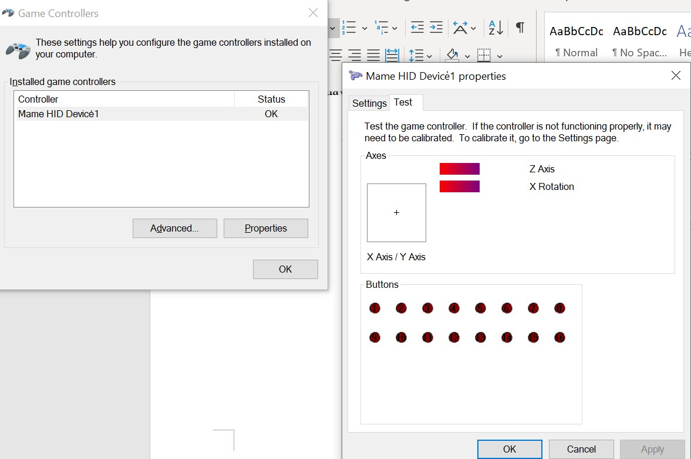

The following is a 15 button arcade stick using the tiva TM4C123GXL microcontroller.
This project has been created without the screen. If you would like to just use the buttons check out this repository 
https://github.com/SnrNotHere16/ArcadeStickWithoutScreen

# 15 Button Arcade Stick with Analog thumb Joystick

# 15 Button Arcade Stick Game Mode: Used while playing the game 
 Initially, I had the idea of having the LCD (ST7735) screen print out the controller's input as the player played the game. Unfortunately that resulted in the game having input lag. So I decided to seperate the game modes into two seperate modes (game mode and print button mode). 
 
 
 Host connected indicates the driver connected successfully. 
 A blinking green LED on the TM4C123GXL also indicates the driver is succesfully connected. 
 
 
 # 15 Button Arcade Stick Print Mode: input is delayed if playing game 
  The following mode prints out the button pressed at the moment onto the LCD screen. The mode is activated by pressing button fifteen (top   small yellow button). As stated before, the player can play with this mode but the input is delayed. In order to get out of print mode,     the user must power off the device and restart it. 
  
  
# Testing inputs
 The best way to test the inputs is to type "Set up USB game controllers" into the windows search bar. This should prompt this screen. 
 
 
 
 Pressing the buttons and moving the thumbstick should be read by the screen. 
 
  
  
 # Schematic
 
 
 # Additional Images
 
 
 
 # Simple Setup
1. Open LM Flash Programmer
  
2. Select TM4C123G LaunchPad 
 
3. Make sure you Tiva c is connected and in DEBUG mode. Go to "Program" and place the bin file ("usb_dev_gamepadWLCD.bin"), which is located in this repository, in "Select .bin file" and click "Program"
  
4. Disconnect the tiva c and connect it in DEVICE mode. To see if the installation is succesful, type "Set up USB game controllers" into the windows search bar. This should prompt this screen. The tiva c should flash it's green LED. 
   
   
  
   
